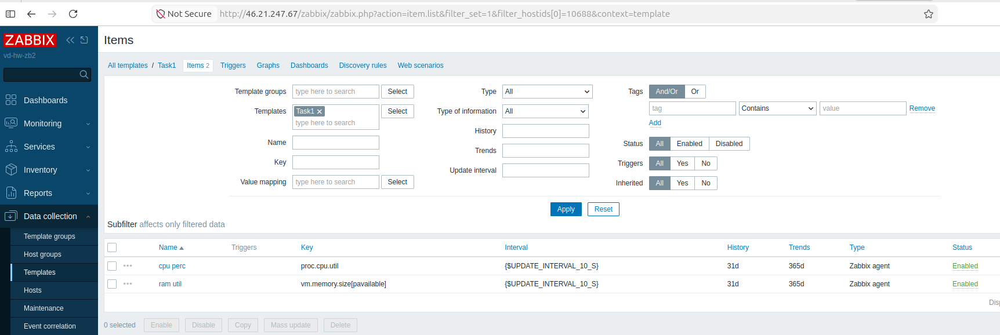
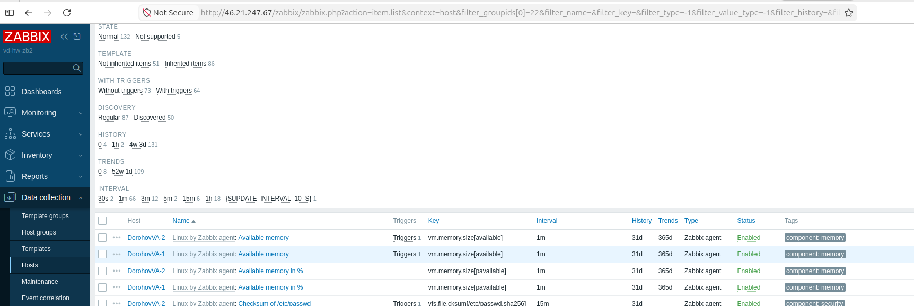
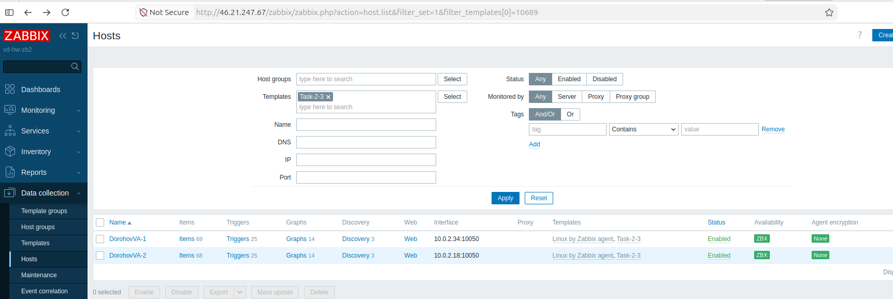
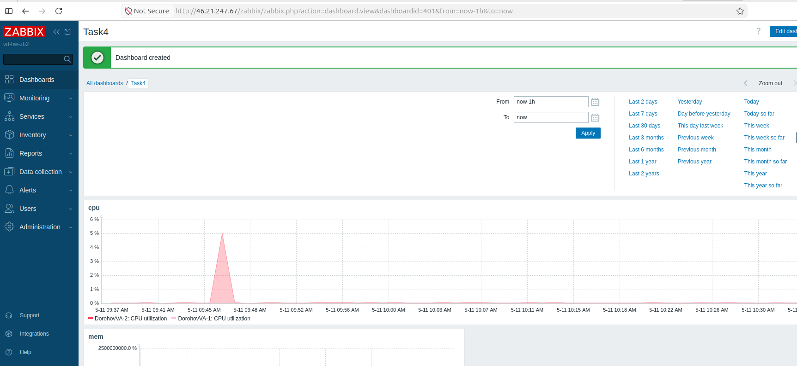
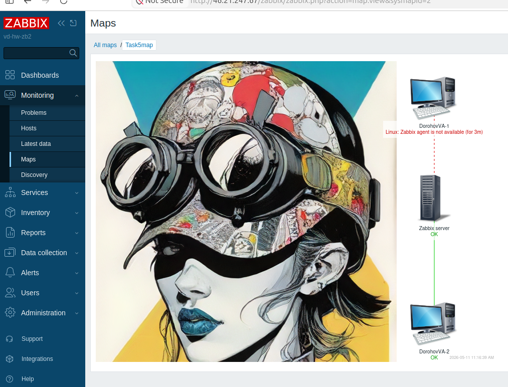
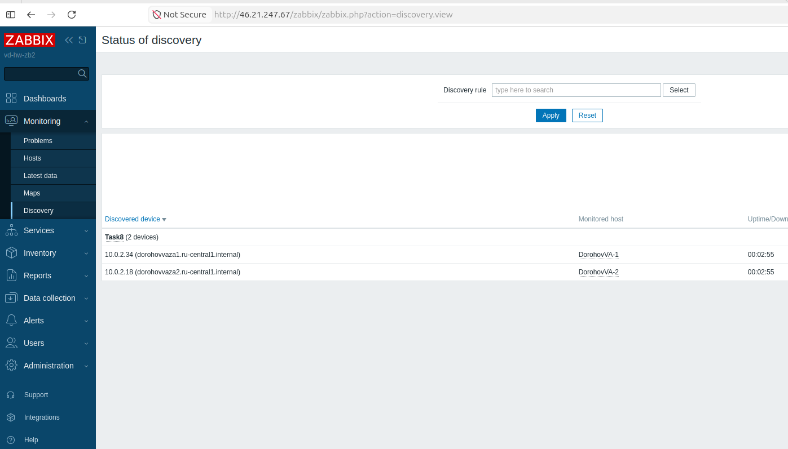

# Домашнее задание к занятию «Система мониторинга Zabbix. Часть 2» Дорохов В.А.

# Задание 1

Создайте свой шаблон, в котором будут элементы данных, мониторящие загрузку CPU и RAM хоста.
Процесс выполнения

    Выполняя ДЗ сверяйтесь с процессом отражённым в записи лекции.
    В веб-интерфейсе Zabbix Servera в разделе Templates создайте новый шаблон
    Создайте Item который будет собирать информацию об загрузке CPU в процентах
    Создайте Item который будет собирать информацию об загрузке RAM в процентах

Требования к результату

    Прикрепите в файл README.md скриншот страницы шаблона с названием «Задание 1»

**Ответ:**

Название сделал Task1

# Задание 2

Добавьте в Zabbix два хоста и задайте им имена <фамилия и инициалы-1> и <фамилия и инициалы-2>. Например: ivanovii-1 и ivanovii-2.
Процесс выполнения

    Выполняя ДЗ сверяйтесь с процессом отражённым в записи лекции.
    Установите Zabbix Agent на 2 виртмашины, одной из них может быть ваш Zabbix Server
    Добавьте Zabbix Server в список разрешенных серверов ваших Zabbix Agentов
    Добавьте Zabbix Agentов в раздел Configuration > Hosts вашего Zabbix Servera
    Прикрепите за каждым хостом шаблон Linux by Zabbix Agent
    Проверьте что в разделе Latest Data начали появляться данные с добавленных агентов

Требования к результату

    Результат данного задания сдавайте вместе с заданием 3

# Задание 3

Привяжите созданный шаблон к двум хостам. Также привяжите к обоим хостам шаблон Linux by Zabbix Agent.
Процесс выполнения

    Выполняя ДЗ сверяйтесь с процессом отражённым в записи лекции.
    Зайдите в настройки каждого хоста и в разделе Templates прикрепите к этому хосту ваш шаблон
    Так же к каждому хосту привяжите шаблон Linux by Zabbix Agent
    Проверьте что в раздел Latest Data начали поступать необходимые данные из вашего шаблона

Требования к результату

    Прикрепите в файл README.md скриншот страницы хостов, где будут видны привязки шаблонов с названиями «Задание 2-3». Хосты должны иметь зелёный статус подключения

**Ответ:**

# Задание 4

Создайте свой кастомный дашборд.
Процесс выполнения

    Выполняя ДЗ сверяйтесь с процессом отражённым в записи лекции.
    В разделе Dashboards создайте новый дашборд
    Разместите на нём несколько графиков на ваше усмотрение.

Требования к результату

    Прикрепите в файл README.md скриншот дашборда с названием «Задание 4»

**Ответ:**

# Задание 5* со звёздочкой

Создайте карту и расположите на ней два своих хоста.
Процесс выполнения

    Настройте между хостами линк.
    Привяжите к линку триггер, связанный с agent.ping одного из хостов, и установите индикатором сработавшего триггера красную пунктирную линию.
    Выключите хост, чей триггер добавлен в линк. Дождитесь срабатывания триггера.

Требования к результату

    Прикрепите в файл README.md скриншот карты, где видно, что триггер сработал, с названием «Задание 5»

**Ответ:**

# Задание 8* со звёздочкой

Настройте автообнаружение и прикрепление к хостам созданного вами ранее шаблона.
Требования к результату

    Прикрепите в файл README.md скриншот правила обнаружения, а также скриншот страницы Discover, где видны оба хоста.*

**Ответ:**

